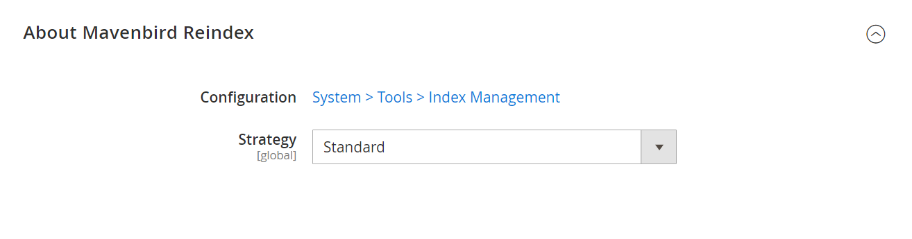
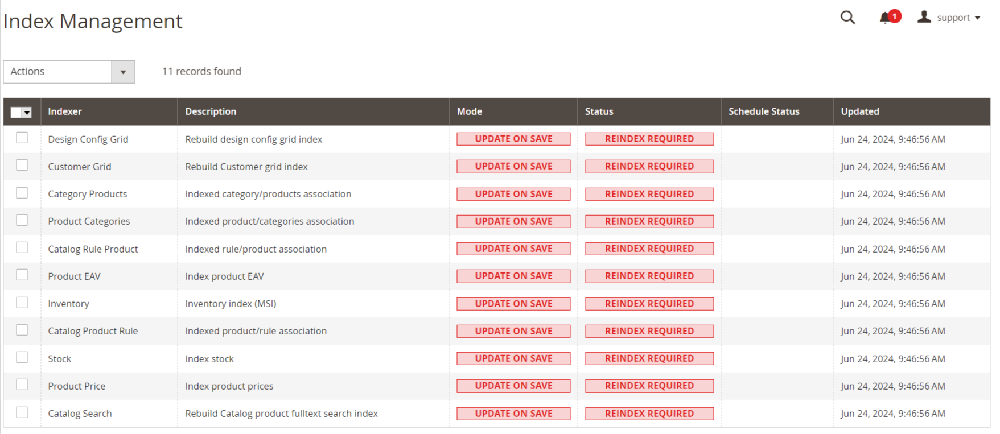

# Reindex Magento 2 / Adobe Commerce from Admin

Reindexing your Magento 2 / Adobe Commerce store from Magento's admin has been removed and your only option is to set your indexes to "Update on Save" or reindex using SSH / CLI command line which is time-consuming. With our free Reindex module for Magento 2, you can quickly and easily update individual or all indexes from within your Magento admin. Ideal for project managers or QA department during site development and testing of new product and functionality. This module is not meant for large productions environment.

## Key Features:

- **Reindex from Admin Panel:**
Easily initiate reindexing processes directly from the Magento admin panel.
- **Real-time Index Status:**
View the status of each index, ensuring you are always informed about the indexing state.
- **Batch Reindexing:**
Perform reindexing on individual indexes or all indexes in a single click.
- **Error Notifications:**
Receive detailed error messages to help identify and resolve indexing issues.
- **Performance Optimization:**
Optimize store performance by keeping indexes up-to-date.

## Benefits:

- **Enhanced Administrative Experience:**
Simplify the management of indexing operations with an intuitive admin interface.
- **Improved Store Performance:**
Ensure your store runs smoothly by keeping indexes current.
- **Time-Saving:**
Save time and reduce the complexity of reindexing tasks with batch processing and one-click reindex options.
- **Greater Control:**
Gain better control over indexing processes with real-time status updates and error notifications.

## Compatibility:
This extension is compatible with Magento 2.4.X (PHP - 8.1 - 8.3) version.

## Installation:
*Install via composer (recommend)* - 

Easy installation process with step-by-step instructions provided for hassle-free setup.
~~~~~~~~~~~~~~~~~~~~~
composer require mavenbird/magento2-reindex
php bin/magento setup:upgrade
php bin/magento setup:static-content:deploy
php bin/magento setup:di:compile
php bin/magento cache:flush
~~~~~~~~~~~~~~~~~~~~~

## Upgrade/Update Module:
Run the following command in Magento 2 root folder for easy update -
~~~~~~~~~~~~~~~~~~~~~
composer update mavenbird/magento2-reindex
php bin/magento setup:upgrade
php bin/magento setup:static-content:deploy
php bin/magento setup:di:compile
php bin/magento cache:flush
~~~~~~~~~~~~~~~~~~~~~

## Customization Options:
Tailor the import/export process to match your store's specific requirements with customizable field mapping and error handling options.

*Configure at Your Ease*

## Support:
Dedicated support team available to assist with installation, customization, and any other queries or concerns.
*[support@mavenbird.com](mailto:support@mavenbird.com)* 

## Get Started:
Simplify and streamline your indexing operations with our Magento 2 Reindex from Admin Extension. Enhance your administrative capabilities and ensure optimal store performance today!

*Thank you!*